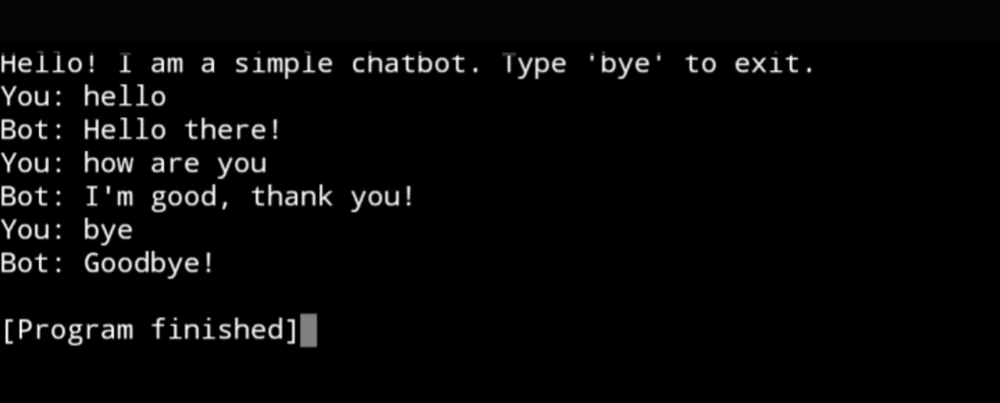

# SKILL-CRAFT-TECHNOLOGY-task-3
Java
# SKILL-CRAFT-TECHNOLOGY – Task 3

🎯 **Internship Role:** Software Development Intern  
🏢 **Company:** Skillcraft Technology  
🛠️ **Language Used:** Java  
📂 **Repository:** Task 3 – [Brief description of the task]

---

## 📝 Task Description

This is the third task assigned during my internship at **Skillcraft Technology**. The objective is to implement [🔍 *Add brief task objective here – e.g., a calculator, pattern program, file handling, etc.*] using core Java concepts.

---

## 📦 Project Structure

| File Name        | Description                          |
|------------------|--------------------------------------|
| `Task3.java`     | Main Java code for the task          |
| `Screenshot_2025-07-29-13-54-16-16_320a9a695de7cdce83ed5281148d6f19.jpg` | Output screenshot |
| `README.md`      | Documentation file                   |

---

## 🖼️ Output

---

## 🧠 Concepts Applied

- Object-Oriented Programming (OOP)
- Java Syntax and Control Structures
- Exception Handling *(if used)*
- [Mention any other relevant Java concept used]

---

## 🚀 About the Internship

This project is part of my Software Development Internship at **Skillcraft Technology**, where I am building real-world applications using Java to improve both logic and problem-solving skills.

---

## 📬 Connect with Me

**👤 Aravind Kumar**  
📧 aravindkumar06062006@gmail.com  
🔗 [GitHub](https://github.com/ARAVINDKUMARGS)  
🔗 [LinkedIn](https://www.linkedin.com/in/aravind-kumar)

---

## ⭐ Feedback & Contribution

If you found this project helpful, feel free to give it a ⭐ on GitHub. Contributions and suggestions are always welcome!
